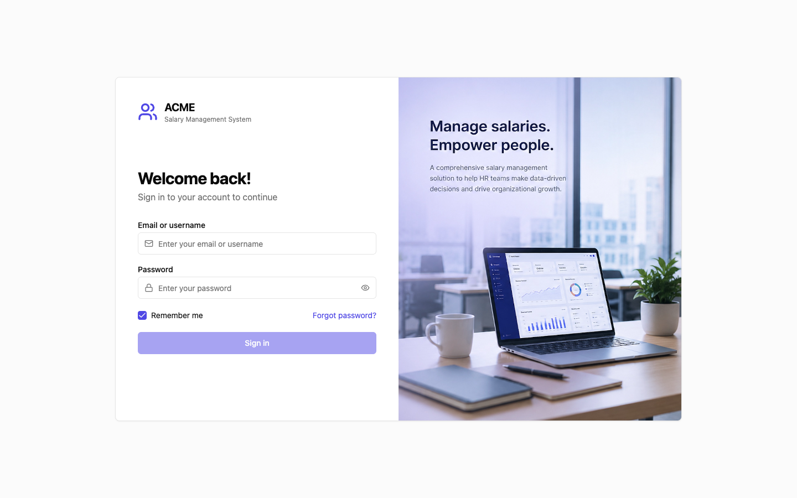
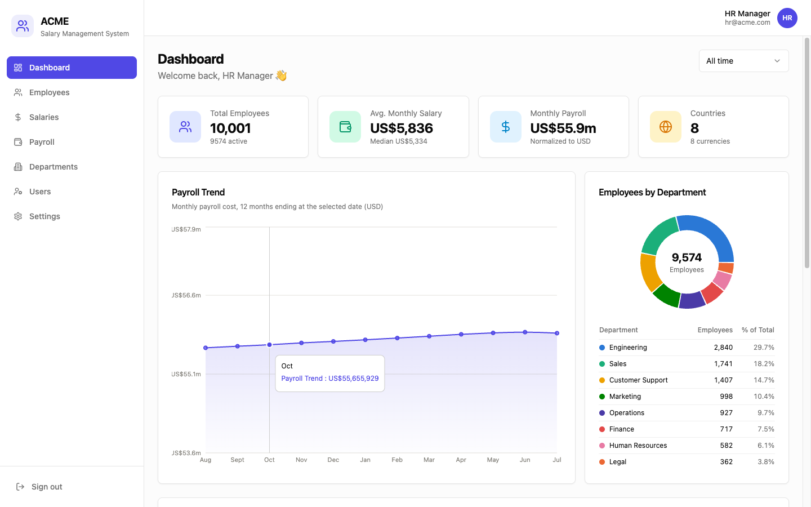
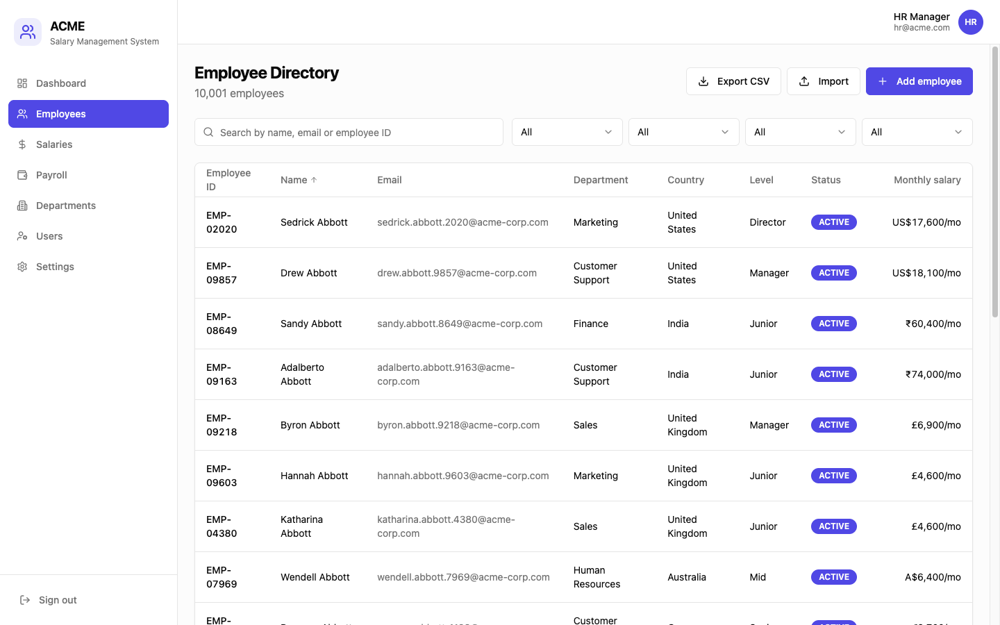
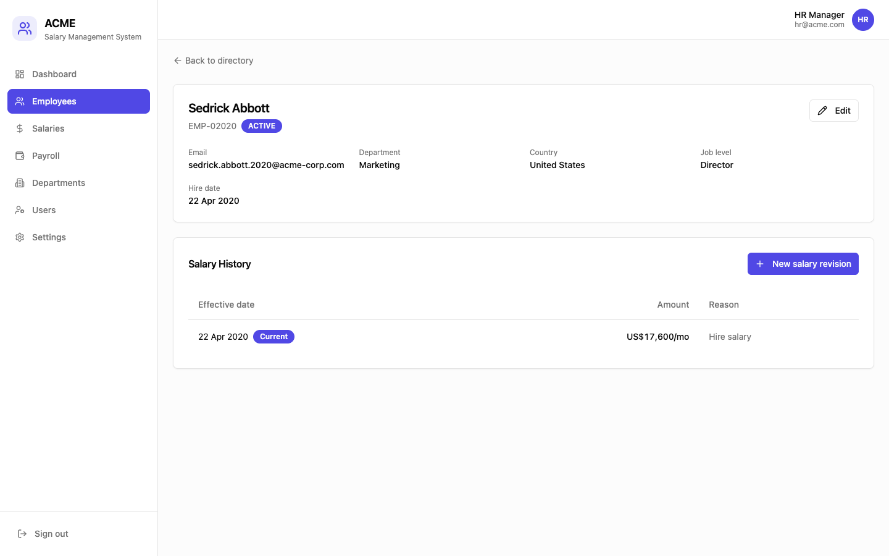
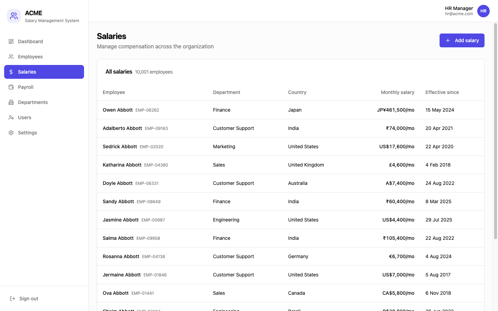
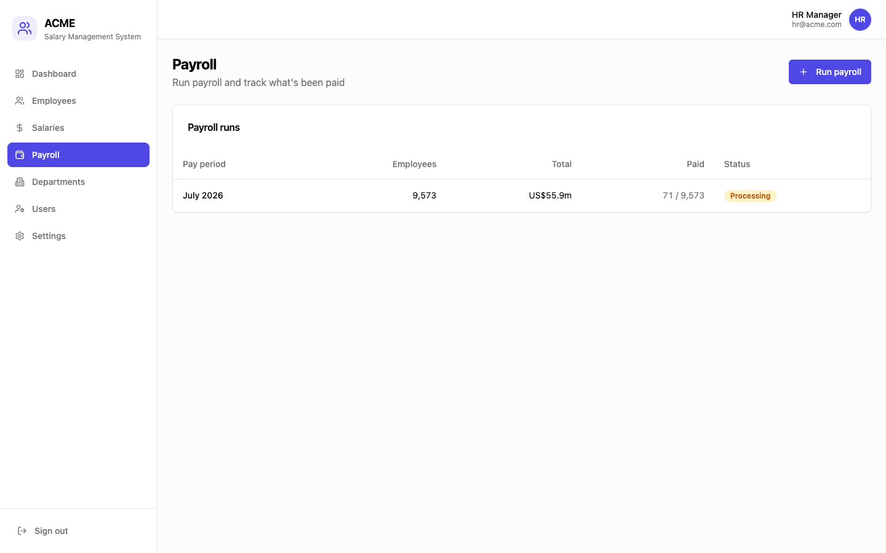
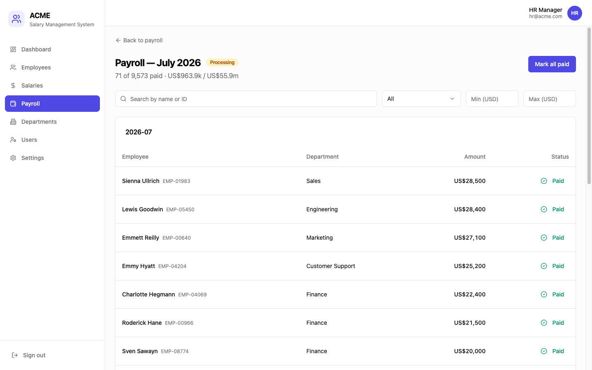
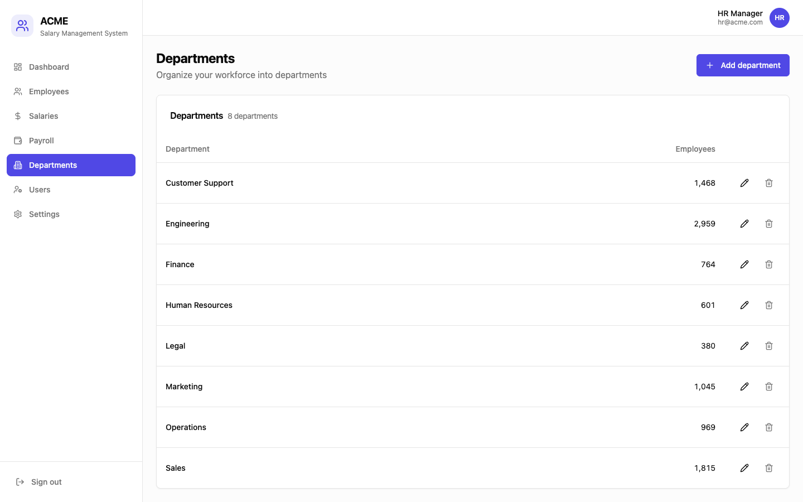
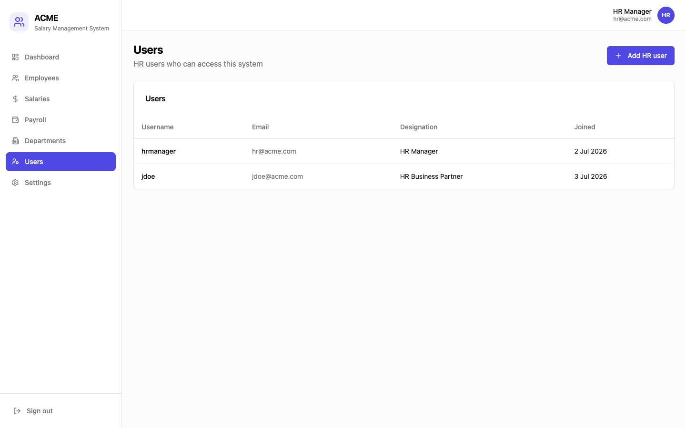
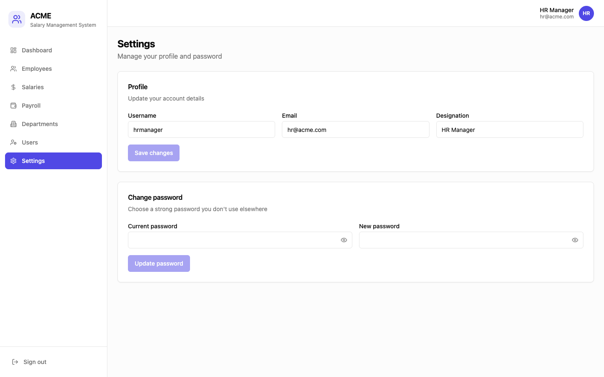

# ACME Salary Management System

Employee salary management software for an HR Manager to manage salary data for ~10,000 employees across multiple countries and answer org-wide compensation questions — replacing an Excel-based workflow.

A TypeScript monorepo: **React + Vite** client, **Express + Prisma** API, and a **shared** package (Zod schemas, types, reference constants, i18n) consumed by both so validation and shapes can't drift.

## Features

### Authentication
Email-or-username login with a full forgot → emailed reset link → single-use token → new password flow. Stateless JWTs (access + refresh, separate secrets) with `tokenVersion` revocation. Accounts are admin-provisioned (no self-registration).



### Insights Dashboard
Headcount, average/median monthly salary and total payroll (normalized to USD), a payroll-trend chart, salary-by-dimension and department breakdowns, and a recent-changes feed. A date-range control (last 7/30/90 days or custom) recomputes the **whole dashboard as of** the selected window — all aggregates are computed in SQL.



### Employee Directory
Server-side paginated, searchable (name / email / employee ID) and filterable (department / country / job level / status) list of all 10,000 employees, with sortable columns. Create and edit employees in a dialog validated by the shared Zod schema.



### Employee Profile & Salary History
Each employee has an append-only salary ledger — a revision is a new record (amount, currency, effective date, reason), never an overwrite — with the current salary flagged.



### Salaries
Org-wide view of every employee's current monthly salary, paginated, with an add-salary flow (employee search + revision).



### Payroll
Run payroll for a month — snapshots each active employee's current salary into immutable line items tracked **Pending → Paid**. Runs list shows progress and status.



A run's line items filter by name/ID, department and USD salary range; **"mark all paid" acts on exactly the filtered subset**, and per-row toggles are available. *(Payment tracking only — no real disbursement/tax/bank rails.)*



### Departments
Full CRUD on departments (DB-backed, so new ones are immediately assignable to employees) with live employee counts. Deleting a department is blocked while it still has employees.



### Users & Settings
HR can add more HR users (admin-provisioned accounts), and edit their own profile / change their own password.




### Bulk Import / Export (CSV)
Contextual actions on the Employee directory: **Export** the current filtered view, and **Import** a CSV to bulk create/update employees + salaries with per-row validation and a downloadable annotated report for rejected rows (partial success — valid rows commit even if some are rejected).

## Tech Stack

- **Client**: React 18 + TypeScript + Vite, shadcn/ui + Tailwind, classic Redux (actions/reducers/selectors + thunks), Formik validated by shared Zod schemas, react-i18next, recharts, sonner.
- **Server**: Node.js + TypeScript, Express, Passport (local + two JWT strategies), Prisma.
- **Shared**: Zod schemas, derived types, reference constants, `ApiResponse<T>` JSend envelope, and i18n locale resources.
- **Data**: PostgreSQL via Prisma, hosted on Supabase. **Deploy**: Vercel (client) / Render or Railway (server).

## Monorepo layout

```
shared/   Zod schemas, types, constants, locales (single source of truth)
server/   Express API — routes → controllers → services → prisma
client/   React app — app/ (store, router, layouts, providers) + features/
```

See [`docs/STRUCTURE.md`](./docs/STRUCTURE.md) for the full folder map and conventions.

## Getting started

Requires **Node ≥ 22** (Prisma 7 CLI) and **yarn**. A `.nvmrc` pins the version — run `nvm use`.

```bash
yarn install                       # install all workspaces
cp server/.env.example server/.env # then fill DATABASE_URL / DIRECT_URL / JWT secrets
yarn workspace @salary/server prisma:migrate   # create the schema
yarn workspace @salary/server prisma:seed      # 10k deterministic employees + HR user

yarn dev:server   # API on http://localhost:5000
yarn dev:client   # app on http://localhost:5173
```

Other scripts: `yarn build` (shared → server → client), `yarn lint`, `yarn test` (shared guard tests + server Jest unit tests).

**Demo credentials** (from the seed): `hr@acme.com` / `DevPassw0rd!`.

## Documentation

- [`PRD.md`](./PRD.md) — product requirements: goal, scope & features, and what's deliberately out (with reasoning).
- [`docs/TRADEOFFS.md`](./docs/TRADEOFFS.md) — architecture & trade-off notes: data model, seeding, CSV import, auth/tokens, monorepo/API contract, payroll, performance, testing.
- [`docs/STRUCTURE.md`](./docs/STRUCTURE.md) — folder structure, per-file responsibilities, and layering rules.
- [`CLAUDE.md`](./CLAUDE.md) — guidance and key decisions for AI coding tools working in this repo.
