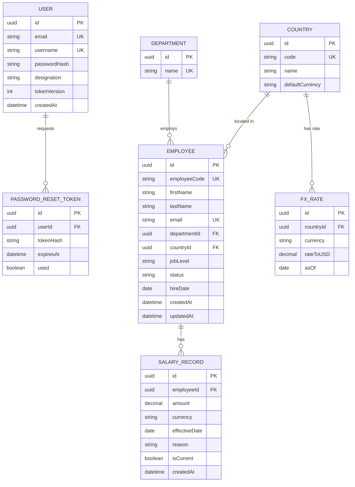

# Architecture & Trade-off Notes

Companion to `PRD.md`. This is where the reasoning behind each decision lives — the "why," not just the "what" — so a reviewer can see the engineering judgment, not only the output.

---

## 1. Data Model



**`User.designation`** — the HR account's job title (e.g. "HR Manager", "HR Business Partner", "VP People") is stored on the user record itself. It's display/context only in v1 (shown in the app header, not used for permissions — see "Explicitly Out: RBAC" in the PRD), but it's the natural seam if role-based access is added later, since a designation already exists to key off of.

**Key decision — salary as an append-only ledger, not a column on `Employee`.** Overwriting `salary` on the employee row loses history and makes "what did we pay them last year" unanswerable — exactly the gap Excel already has. `isCurrent` is a denormalized flag maintained on write (set previous record's `isCurrent=false` in the same transaction) so the hot-path query ("current salary for employee X") stays a single indexed lookup instead of a `MAX(effectiveDate)` scan every time.

**Money as `decimal`, not `float`.** Floating point rounding on currency is a classic, avoidable bug class — Prisma's `Decimal` type maps to Postgres `numeric`.

---

## 2. Seed Data Strategy (10,000 employees)

**Goals:** realistic enough to make the dashboard's insights meaningful, deterministic enough to be reproducible/gradable, fast enough to not be annoying to re-run.

- **Generator:** `@faker-js/faker` with a **fixed seed** (`faker.seed(42)`) — every run produces identical data, so the grader's dashboard numbers match what's described in the demo video and nobody has to debug "why is my count different."
- **Distribution, not pure randomness.** Assigning salary as `random(min, max)` per employee produces a flat distribution that makes every dashboard chart look like noise. Instead: define a base salary band per (country, job level) pair, then sample from a lognormal-ish spread around that band. This is what makes "average salary by department/country" a meaningful, presentable chart instead of a flat line.
- **Realistic org shape:** ~6–8 countries (different currencies), 6–10 departments, 4–5 job levels, weighted so headcount roughly pyramids (more ICs than managers than directors) — mirrors a real org and gives the dashboard's "band" breakdown something to show.
- **Salary history, not just current salary.** Each employee gets 1–3 historical `SalaryRecord` rows (hire salary, maybe one raise) so the "recent salary changes" feed and history view aren't empty on a fresh seed.
- **Performance:** insert in batches (`createMany` in chunks of ~500–1000) inside a single script run, rather than 10,000 individual `INSERT`s — the difference is minutes vs. seconds at this scale. Indexes are created *before* or immediately after the bulk load, not per-row.
- **Idempotency:** the script truncates (or upserts by `employeeCode`) before inserting, so `npm run seed` is safe to re-run during development and in CI/demo setup without manual cleanup.

---

## 3. Bulk CSV Import — Validation & Error Handling

This directly answers "what if the sheet has a missing salary / missing name / etc." The core principle: **partial success, not all-or-nothing.** An HR manager uploading a 500-row CSV where 3 rows are malformed should get 497 employees imported and a clear report on the 3 — not a single opaque failure forcing them to hunt through the whole file.

**Pipeline:**
1. **Stream-parse**, don't load the whole file into memory (`csv-parse` in streaming mode) — matters once files approach thousands of rows, and it's the same code path whether the demo file is 50 rows or 10,000.
2. **Validate every row independently** against a schema (Zod) before touching the database:
   - `name` missing/blank → reject row: `"Missing employee name"`.
   - `salary` missing, non-numeric, zero, or negative → reject row: `"Invalid or missing salary"`.
   - `email` missing or malformed → reject row (email is the natural upsert key).
   - `country`/`currency` code not in our reference tables → reject row rather than silently defaulting, since a wrong currency silently corrupts payroll totals — the whole point of the dashboard.
   - Duplicate `employeeCode`/`email` **within the same file** → keep the last occurrence, flag the earlier one as superseded in the report (not a hard failure, since re-uploads/corrections are the normal case).
   - Duplicate against an **existing** employee → treated as an update (upsert), not a duplicate error — this is how HR corrects a typo without a separate "edit" flow.
3. **Two passes, not row-by-row transactions.** Validate the entire file first, collect `{validRows, errors[]}`, then bulk-insert only the valid rows in one batched transaction. This avoids the worst outcome — a transaction rolled back halfway through a 9,000-row file because row 8,999 had a typo.
4. **Response:** count of rows imported/updated/rejected, plus a downloadable CSV of rejected rows annotated with a `reason` column (same shape as the input, so the HR manager can fix and re-upload the *same* file).
5. **CSV only for v1** (see PRD "out of scope") — this is the trade-off that keeps import robust rather than trying to handle every `.xlsx` quirk (merged headers, multiple sheets, formula cells) that would eat disproportionate time for a feature that isn't the core ask.

---

## 4. Auth Architecture

Explicitly **not** trying to maximize security theater here — the brief is a proper, complete forgot/reset-password flow, not a compliance exercise. But "simple" ≠ "sloppy":

- **Login:** email *or* username + password, verified via a Passport **local strategy** (looks up the user, compares against `passwordHash` with bcrypt, cost 12). No social login (explicit non-goal — HR-only internal tool).
- **Tokens — stateless JWTs, no server-side token table.**
  - On successful login, two JWTs are issued, both signed by the server: an **access token** (`{ userId, tokenVersion, type: "access" }`, ~15 min expiry) and a **refresh token** (`{ userId, tokenVersion, type: "refresh" }`, ~7–30 day expiry). Access and refresh tokens are signed with **different secrets**, so a leaked access-token secret can't be used to forge a refresh token.
  - Both tokens are returned in the login response body and stored in the client's `localStorage` (not cookies) — deliberate, since the frontend (Vercel) and backend (Render/Railway) are on different origins, and cross-site cookies need finicky `SameSite=None; Secure` + CORS handling that Authorization-header bearer tokens sidestep entirely. This is a documented trade-off, not an oversight: `localStorage` is readable by any JS on the page, so it's more exposed to XSS than an httpOnly cookie would be. It's an acceptable trade for a single-role internal HR tool with server-rendered-by-us React and no third-party scripts; the blast radius is further bounded by the short access-token TTL and the DB check below.
  - Every API call sends `Authorization: Bearer <accessToken>`. A **Passport `passport-jwt` strategy** verifies the signature/expiry/`type: "access"` on every protected route — this part stays a pure in-memory check, no DB hit, so it's fast on the common path.
  - **The DB check that matters:** a valid JWT signature alone only proves *a* token was issued by us — it doesn't prove the account is still real or the token hasn't been superseded. So on **login** and on **`/api/auth/refresh`** specifically, the server also loads the user by `userId` and confirms (a) the user still exists (hasn't been deleted/deactivated) and (b) the token's `tokenVersion` claim matches `User.tokenVersion` in the DB. This is one indexed row lookup by primary key, not a token table — cheap, and it's what makes "kill this session" possible for an otherwise-stateless token.
  - **Refresh loop:** access token expires → a protected call returns 401 → the frontend's fetch/axios interceptor calls `/api/auth/refresh` with `Authorization: Bearer <refreshToken>` → server verifies the refresh JWT (`type: "refresh"`, signature, expiry) via a second `passport-jwt` strategy configured with the refresh secret, does the user-exists + `tokenVersion` check above, and — if all pass — issues a fresh access + refresh token pair. Client overwrites both in `localStorage` and silently retries the original request. This repeats until the refresh token itself expires, at which point the user is redirected to log in again.
  - **Revocation without a token table:** logout-everywhere and password reset both just **increment `User.tokenVersion`**. Every refresh token issued before that instant fails the version check on its next use. The one bounded exception: an already-issued *access* token remains valid for the rest of its own ≤15-minute life, since we don't re-check version on every single request (that would mean a DB hit per API call, defeating the point of a stateless access token) — an explicitly accepted, small window.
- **Forgot / reset password — full token life cycle:**
  1. **Request:** user submits email/username on the "Forgot password" form. Server always responds with the same generic "if that account exists, we've sent a link" message regardless of whether the account exists — prevents user enumeration via the reset form.
  2. **Token issuance:** server generates a cryptographically random token (e.g. 32-byte random string). The **raw token** is what gets embedded in the emailed reset link (`/reset-password?token=...`); only its **hash** (SHA-256) is written to `PASSWORD_RESET_TOKEN.tokenHash` in the DB, alongside `userId`, `expiresAt` (now + 30 min), and `used = false`. This means a database leak alone can never yield a usable reset link — the raw token only ever exists in the email and in transit.
  3. **Delivery:** the link is emailed via a dev/stub provider (Ethereal / logged to server console — see PRD's out-of-scope on production email). The flow itself is production-shaped, so swapping in a real ESP later is a one-line change, not a redesign.
  4. **Validation (on visiting the link / submitting a new password):** server hashes the token from the URL and looks up a matching, unexpired, unused row in `PASSWORD_RESET_TOKEN`. If it doesn't match / is expired / already used → reject with a clear "this link is invalid or has expired, request a new one" — never a generic 500.
  5. **Consume:** if valid, in one transaction — the new password is hashed and written to `User.passwordHash`, the reset-token row is marked `used = true` (so it can never be replayed even within its own 30-minute window), and **`User.tokenVersion` is incremented**. Per the token architecture above, that last step immediately invalidates every refresh token issued before this moment — so a compromised-password scenario is actually closed by the reset, not left half-open.
- **Rate limiting** on `/login` and `/forgot-password` (basic in-memory or Redis-backed limiter) — cheap insurance against brute force, doesn't complicate the UX.
- **Explicitly deferred:** email verification on account creation (accounts are seeded/admin-provisioned, not self-registered, so there's no unverified-email state to worry about in v1).

---

## 5. Monorepo, Shared Validation & API Contract

**Monorepo layout:** `client/` (React + TS + shadcn/ui), `server/` (Node + TS + Express + Passport), `shared/` — using npm/pnpm workspaces. `shared/` is the single source of truth for anything both sides need to agree on, so validation rules and shapes can't silently drift apart between frontend and backend:
- **Zod schemas** for every DTO (create/update Employee, create SalaryRecord, login, forgot/reset password, CSV row) — one schema, imported on the server to validate incoming requests, and on the client to validate forms before submit.
- **TypeScript types derived from those schemas** (`z.infer<typeof CreateEmployeeSchema>`) instead of hand-duplicated interfaces on each side.
- **Reference constants** (country/currency list, job levels, departments) — so a dropdown on the client and an enum check on the server read from the same array, not two lists that can go out of sync.
- **The `ApiResponse<T>` envelope type** (below), so both sides type-check against the same response shape.

**Forms — Formik + the shared Zod schema.** Each form's `validate`/`validationSchema` calls the *same* schema from `shared/` that the corresponding API route validates against. This means a validation rule only gets written once: if "salary must be positive" changes, it changes in one file and both the browser-side error message and the server-side rejection update together — they cannot disagree.

**API response contract — one envelope shape, three states**, modeled on JSend since it maps cleanly onto "is this a success, a client mistake, or a server problem":

```jsonc
// status: "success" — 2xx. `data` is the payload.
{ "status": "success", "data": { "id": "...", "firstName": "Jane" } }

// status: "fail" — 400/422, client-side problem (validation, bad input).
// `data` is a field→message map — the exact shape Zod's error map produces,
// so it drops straight into Formik's field errors with no translation step.
{ "status": "fail", "data": { "email": "Invalid email format", "salary": "Must be a positive number" } }

// status: "error" — 401/403/404/500, server-side problem (exception, auth failure, not found).
{ "status": "error", "message": "Invalid or expired refresh token", "code": "AUTH_TOKEN_EXPIRED" }
```

A shared Express error-handling middleware and a shared Zod-validation middleware are what actually produce `fail`/`error` responses, so individual route handlers only ever return `data` on the happy path — they don't hand-roll the envelope each time.

**Internationalization (i18n) readiness.** No language beyond English is required now, but retrofitting i18n onto a component tree full of hardcoded strings later is expensive and error-prone (easy to miss strings, easy to break layout once text length changes). The cheap insurance is to pay a small, fixed cost up front instead:
- Translation resource files live under `shared/locales/` (e.g. `shared/locales/en.json`), keyed by translation key (`employee.directory.searchPlaceholder`, `salary.history.title`, etc.) — not embedded in component code, and not duplicated between client validation-error copy and server-side messages where they overlap.
- The client wires every user-facing string through an i18n library (e.g. `react-i18next`) from the very first component — `t('employee.directory.searchPlaceholder')` instead of a hardcoded string — even though only `en.json` exists in v1. This is the part that's expensive to retrofit later and cheap to do from the start.
- Adding a second language later is then purely additive: drop a new `shared/locales/<locale>.json` next to the English one and register the locale — no component changes, no hunting for strings that got missed.
- Numbers, currency, and dates (salary amounts, effective dates) already go through locale-aware `Intl` formatting rather than manual string formatting, since that's needed for multi-currency display regardless — it composes naturally with a future locale switch instead of needing separate handling.
- **Validation and error messages are locale keys, not English sentences.** The Zod schemas' custom messages are keys (`errors.validation.common.invalidEmail`), so the `fail` envelope carries keys and the client resolves them via `t(key, VALIDATION_LIMITS)` in whatever language the user selected — the server stays completely language-unaware (stateless: no `Accept-Language` handling, no per-user language state). Since the same schemas run client-side in Formik, local and server-returned errors resolve through the identical `t()` path. Supporting pieces:
  - **`VALIDATION_LIMITS`** (`shared/constants/`) single-sources every numeric limit: schemas use it for the rules, locale texts reference it via `{{placeholder}}` interpolation, and the client passes it to every error `t()` call — a changed limit updates rule and copy together in every language.
  - **The `error` envelope needs no change**: its `code` field is already the translation key (`t('errors.codes.' + code)` with a generic fallback); the English `message` remains for debugging only.
  - **The one server-side translation exception:** the CSV import's rejected-rows report is a downloadable file read outside the client app, so its `reason` column can't stay keys — the import request carries `?lang=`, and the server renders reasons from the same `shared/locales/` files (English fallback). Language arrives per request; still stateless.
  - **Guardrails:** a unit test in `shared/` feeds every schema invalid payloads and asserts each emitted message is a key that exists in `en.json` (and that `{{placeholders}}` match `VALIDATION_LIMITS`); the server's validate middleware maps any non-key Zod default message to `errors.validation.common.invalid` so raw Zod English never reaches users.
- Explicitly **not** doing now: actually translating content, RTL layout support, or locale-specific date/number format testing — those are only worth doing once a real second language is requested.

---

## 6. Performance & Scalability (10,000+ employees)

- **Never ship all 10,000 rows to the client.** Employee list is server-side paginated + filtered + sorted (offset or keyset pagination); the frontend never holds more than one page in memory.
- **Indexes** on the columns actually queried: `email`, `employeeCode`, `departmentId`, `countryId`, and `(employeeId, isCurrent)` on `SalaryRecord` for the "current salary" lookup.
- **Dashboard aggregates computed in SQL** (`GROUP BY` department/country/level with `AVG`/`COUNT`), not pulled into the app layer and reduced in JS — the database is far better at this at 10k+ rows, and it keeps the API payload small.
- **N+1 avoidance:** Prisma queries use explicit `select`/`include` for exactly the joined data a view needs, not eager-loading whole relations by default.
- **Connection pooling:** Supabase's pooled connection string (pgbouncer) is used from the backend, since serverless/traditional Node backends can otherwise exhaust Postgres's connection limit under load.
- **Deferred, noted for future:** if dashboard aggregate queries become a bottleneck at much larger scale, a materialized view refreshed periodically (or a small pre-aggregated rollup table updated on write) would trade a bit of staleness for speed — not needed at 10k rows, worth stating as the next lever.

---

## 7. Cloud, Deployment & Commit Strategy

- **Database:** Supabase-hosted Postgres — managed, free tier, gives a pooled connection string and a hosted environment without standing up infra by hand.
- **Backend:** Node/Express + TypeScript, deployed to Render or Railway (containerized or native Node buildpack).
- **Frontend:** React + TypeScript + shadcn/ui, deployed to Vercel.
- **Secrets:** `.env` (never committed) with a checked-in `.env.example` documenting required variables.
- **CI:** GitHub Actions running typecheck + lint + unit tests on every push — cheap to set up, and it's tangible evidence of engineering rigor for the reviewer.
- **Commit history as a deliverable, not an afterthought.** The assessment explicitly grades incremental commits, so the build order is structured to commit at each meaningful milestone rather than as one final dump: project scaffold → Prisma schema → seed script → core CRUD API → auth (login → forgot/reset) → frontend scaffold + directory view → salary history UI → dashboard/insights → CSV import/export → tests → CI → deployment → docs/demo video. Each commit is small enough to review in isolation.

---

## 8. Testing Strategy

- **Unit tests** target logic that's easy to get subtly wrong and doesn't need a network: CSV row validation rules (the missing-name/missing-salary cases above), salary-aggregation math, FX normalization, password-reset token expiry/single-use logic, password hashing/verification.
- **Fast & deterministic by construction:** no real network calls, no real email sends, no wall-clock dependence (inject a clock/`now()` where expiry matters) — tests use an in-memory/test schema or a mocked Prisma client, not the live Supabase instance.
- **Integration tests** cover the main API routes (auth, employee CRUD, import) against a disposable test database, kept separate from unit tests so the fast suite stays fast.

---

## 9. AI Tool Usage

Per the assessment's ask to show *how* AI tools were used, not just that they were: prompts and instructions used with AI coding tools during this build are logged as the project progresses (a running `docs/AI_USAGE.md` — added once implementation starts) rather than reconstructed after the fact, so it reflects the actual process.
